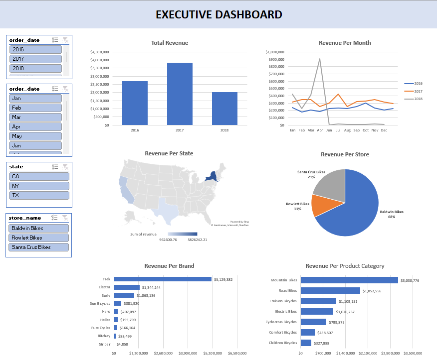
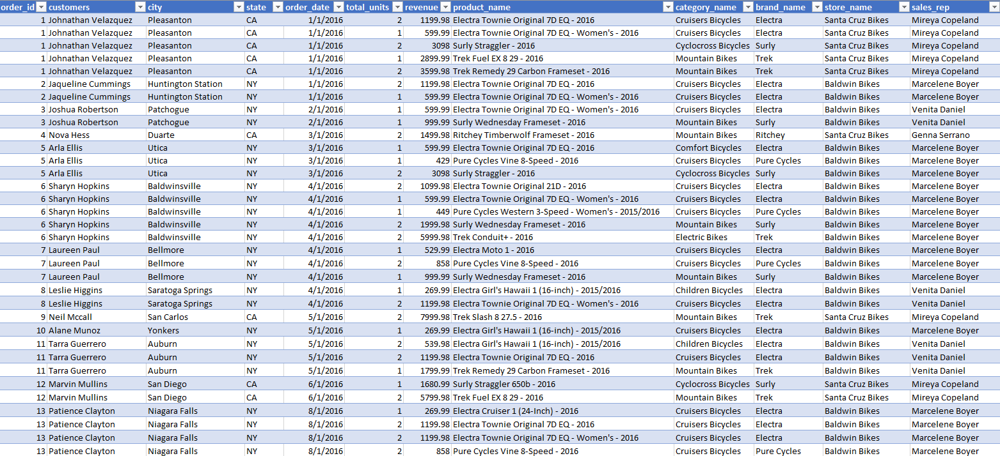
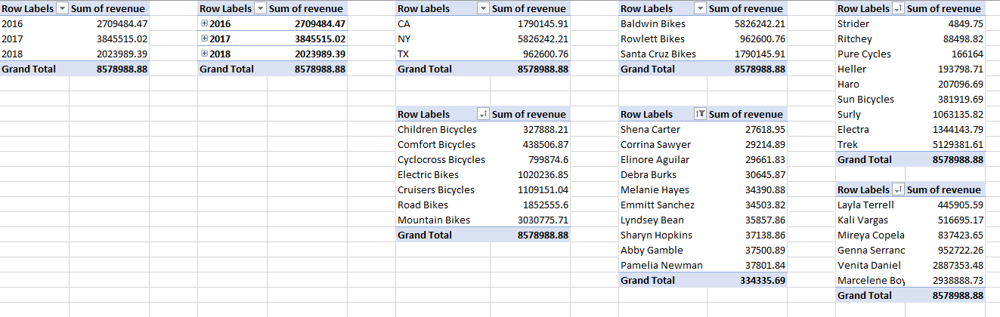

# Bike Sales Business Intelligence Dashboard

This project features a dynamic and interactive dashboard built in Microsoft Excel to analyze bike sales performance. It leverages Pivot Tables and Slicers to provide a comprehensive overview of sales data, allowing for easy exploration of key business metrics.

## Dashboard Preview

Below is a preview of the final interactive dashboard. The slicers allow for real-time filtering of the data to uncover insights instantly.

## Features & Key Analyses

This dashboard provides insights into several key performance indicators. The entire report is interactive, allowing for deep-dives into the data.

### Key Metrics Visualized:
* **Total Revenue per Year:** Tracks overall business growth over time.
* **Revenue per Month:** Identifies seasonal trends and monthly performance.
* **Revenue per State:** Highlights top-performing geographical regions.
* **Revenue per Store:** Pinpoints the most profitable store locations.
* **Revenue per Brand & Product Category:** Shows which product lines are driving sales.
* **Top 10 Customers:** Identifies the most valuable customers by revenue.
* **Revenue per Sales Representative:** Measures individual and team sales performance.

## Project Structure Example:

**Data Sample**              
 

**Pivot Table Setup**

## Tools Used

* **Microsoft Excel:** Core tool for data storage, cleaning, analysis, and visualization.
* **Pivot Tables:** Used for summarizing and aggregating large datasets to extract meaningful patterns.
* **Slicers & Timelines:** Implemented for creating an intuitive and interactive user experience, allowing for easy data filtering.

## How to Use

1.  **Download** the `.xlsx` file from this repository.
2.  **Open** the file in a compatible version of Microsoft Excel.
3.  **Enable Editing** and **Enable Content** if prompted by Excel to ensure full interactivity.
4.  Navigate to the **"Dashboard"** sheet.
5.  Use the **Slicers** (buttons for Year, State, Brand, etc.) to filter the data and watch the charts update automatically.
